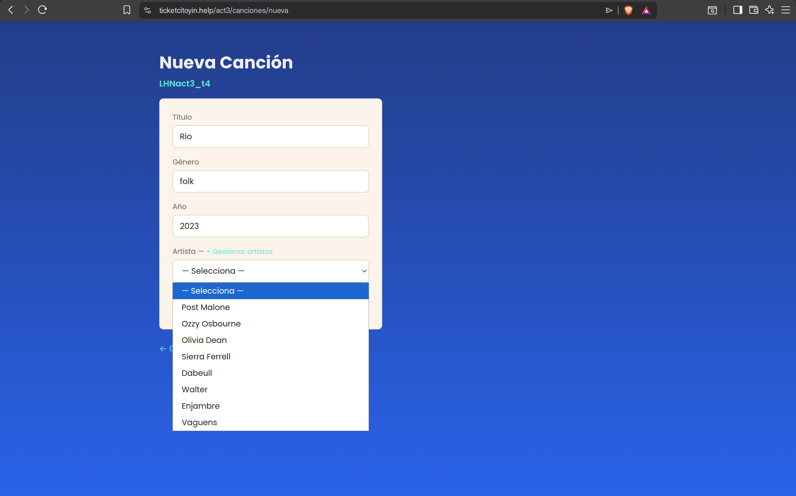
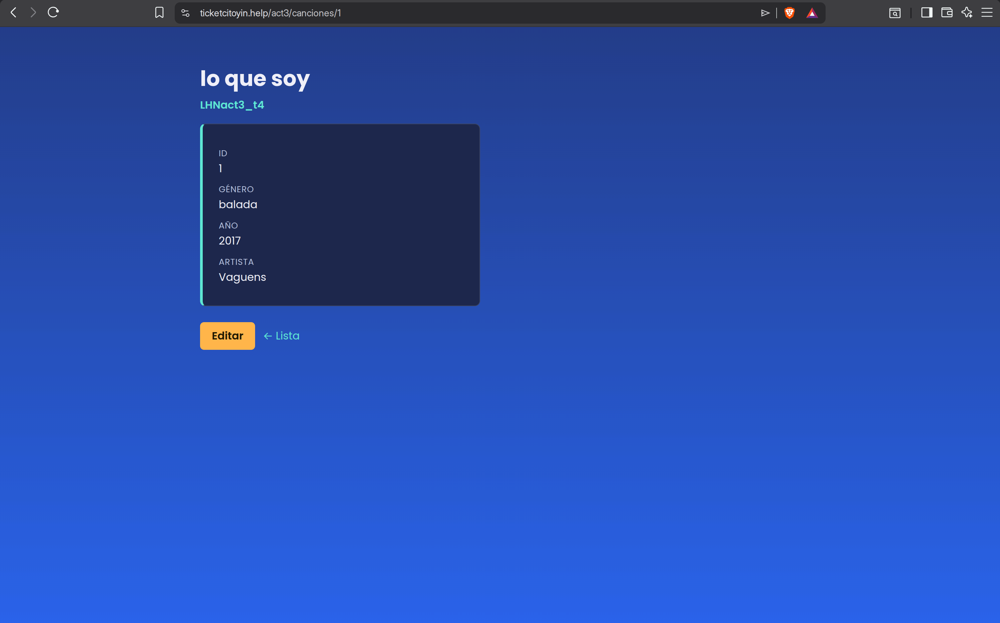
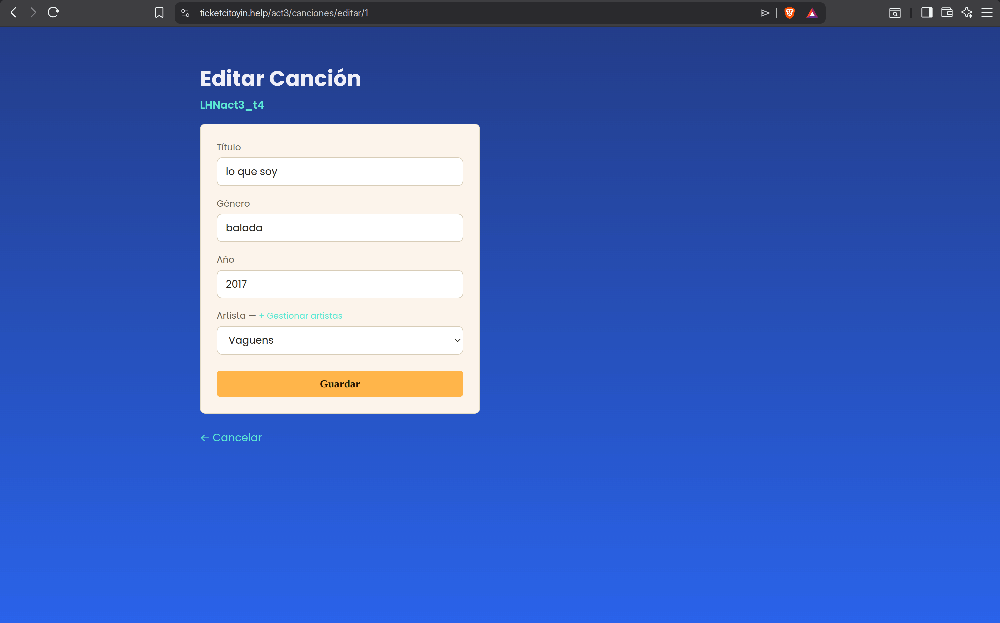
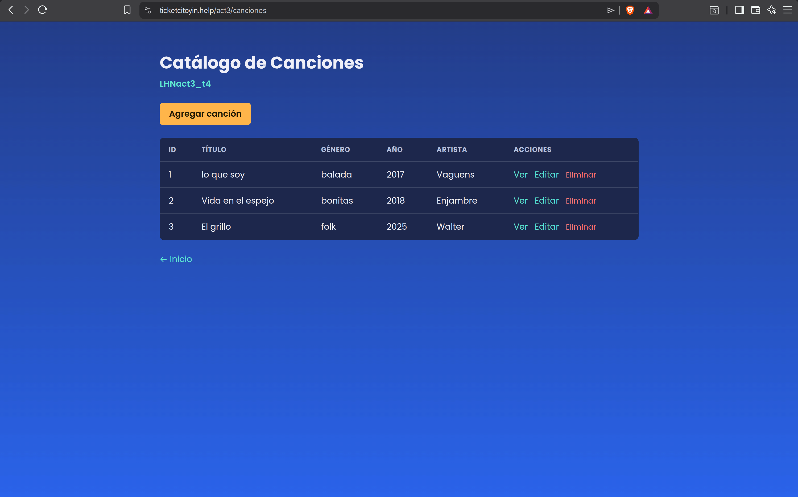
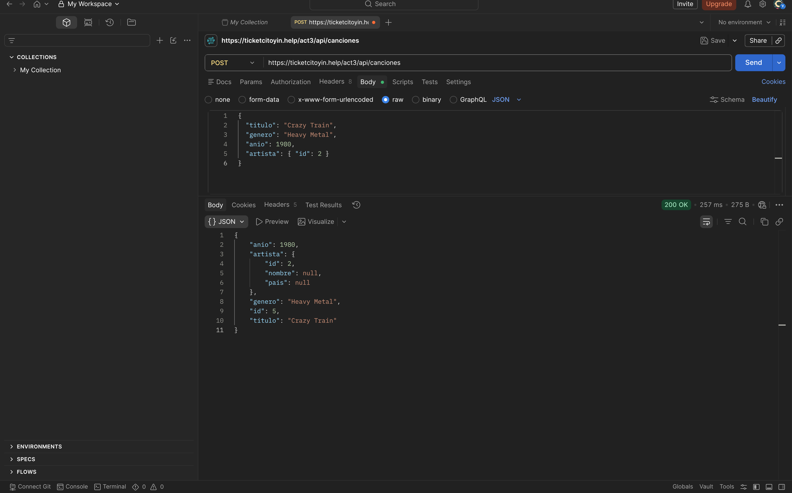
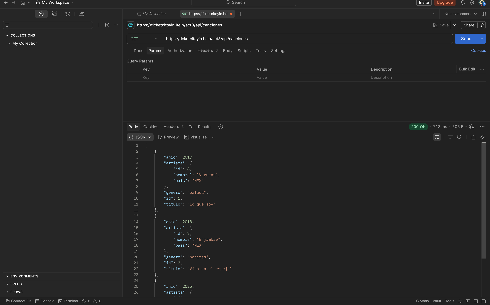
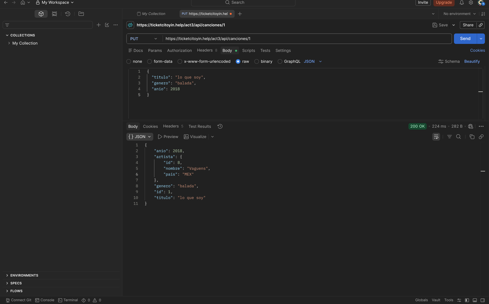
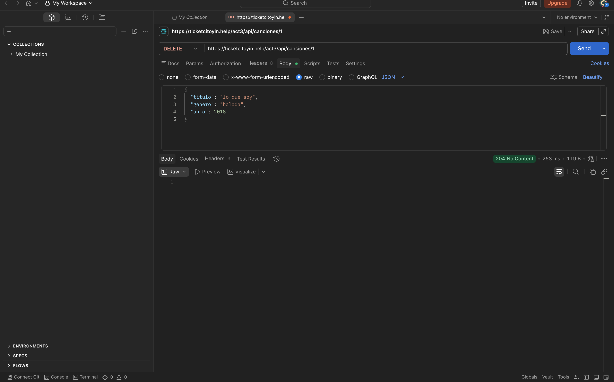

# LHNact3_t4 — CRUD con Spring Boot + JPA + MySQL

**Alumno:** Noel Lopez Herrera  
**Grupo:** 7SC  
**Proyecto:** LHNact3_t4

CRUD completo de Canciones con Spring Boot, Spring Data JPA, MySQL y Thymeleaf. Implementa una relación `@ManyToOne` entre `Cancion` y `Artista`.

---

## Entidades y relación

**`Artista`** (tabla `artistas`) y **`Cancion`** (tabla `canciones`).  
Relación: **ManyToOne** — muchas canciones pertenecen a un artista.

```java
@ManyToOne
@JoinColumn(name = "artista_id")
private Artista artista;
```

---

## Lista de canciones — relación visible

Vista principal con todas las canciones registradas. La columna **Artista** muestra el nombre obtenido mediante la relación JPA, no el ID de la llave foránea.


---

## Nueva canción

Formulario para registrar una canción. El artista se selecciona desde un menú desplegable cargado desde la base de datos.



---

## Detalle de canción

Muestra la información completa del registro, incluyendo el nombre del artista a través de la relación.



---

## Editar canción

Formulario precargado con los datos actuales del registro para su modificación.



---

## Eliminar canción

Lista actualizada después de eliminar un registro.



---

## API REST — Postman

### POST — Crear canción

```json
POST /api/canciones
{
  "titulo": "Crazy Train",
  "genero": "Heavy Metal",
  "anio": 1980,
  "artista": { "id": 2 }
}
```



---

### GET — Listar canciones

```
GET /api/canciones
```

La respuesta incluye el objeto `artista` con `id` y `nombre`, no solo la clave foránea.



---

### PUT — Actualizar canción

```json
PUT /api/canciones/1
{
  "titulo": "lo que soy",
  "genero": "balada",
  "anio": 2018
}
```



---

### DELETE — Eliminar canción

```
DELETE /api/canciones/2
```

Respuesta: `204 No Content`



---

## Endpoints disponibles

| Método | Ruta | Descripción |
|---|---|---|
| GET | `/` | Página de inicio |
| GET | `/canciones` | Lista todas las canciones |
| GET | `/canciones/{id}` | Detalle de una canción |
| GET | `/canciones/nueva` | Formulario nueva canción |
| POST | `/canciones/guardar` | Guardar canción (form) |
| GET | `/canciones/editar/{id}` | Formulario editar |
| GET | `/canciones/eliminar/{id}` | Eliminar canción |
| GET | `/artistas` | Gestionar artistas |
| POST | `/artistas/guardar` | Agregar artista |
| GET | `/api/canciones` | Lista JSON |
| GET | `/api/canciones/{id}` | Detalle JSON |
| POST | `/api/canciones` | Crear JSON |
| PUT | `/api/canciones/{id}` | Actualizar JSON |
| DELETE | `/api/canciones/{id}` | Eliminar |
| GET | `/api/artistas` | Lista artistas JSON |

---

## VPS

- **Act3:** `https://ticketcitoyin.help/act3/`
- **Act2:** `https://ticketcitoyin.help/act2/`
